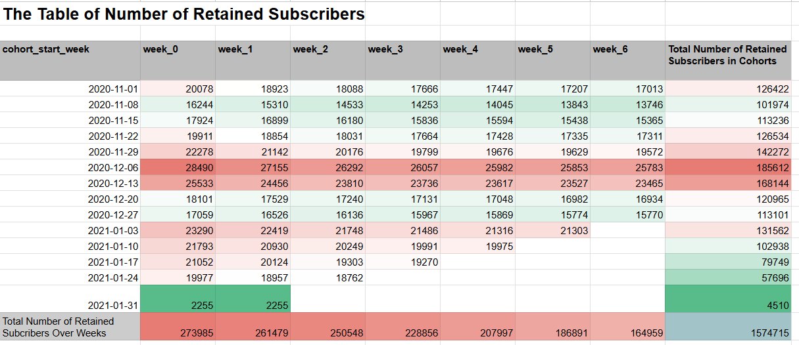
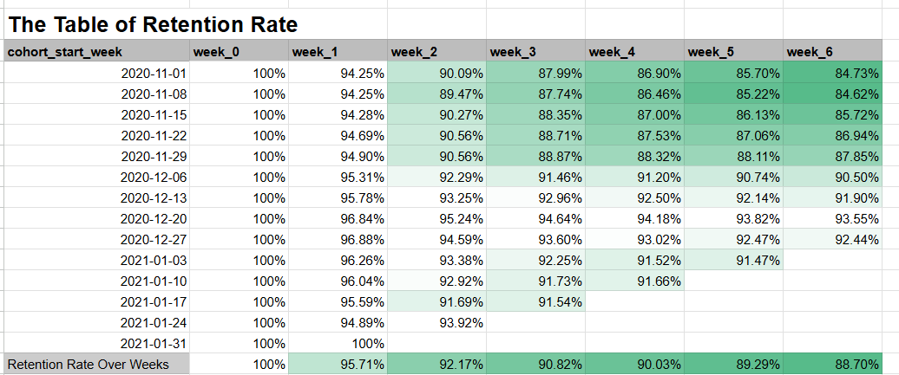
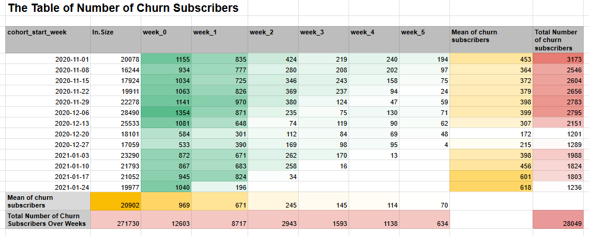
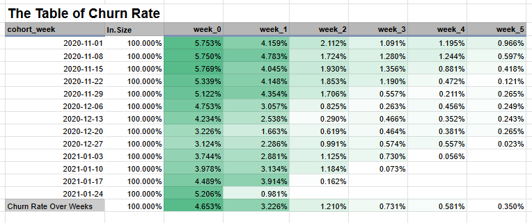

# Churn and Retention Analysis

## Overview

The objective of this project was to examine subscription churn by analysing weekly retention metrics. 

The tasks included: 
1. Computing weekly retention rates for different user cohorts based on their week of subscription; 
2. Monitoring the number of users who remain active over a period of 6 weeks.

The project involved writing an SQL query to extract cohort data from the database of a hypothetical company, with a specific emphasis on tracking weekly retention from the initial week of subscription (week 0) through to week 6.

Additionally, it was necessary to visualise this data using tools like Google Sheets to uncover trends

## 🛠️ Methodology

### Data Processing

The link for the SQL query: [Add SQL Query Link Here]

## 📈 Results & Visualizations

#### 1. Retention over time:
   
   
   
   

#### 2. Churn analysis:
   
   

   

---